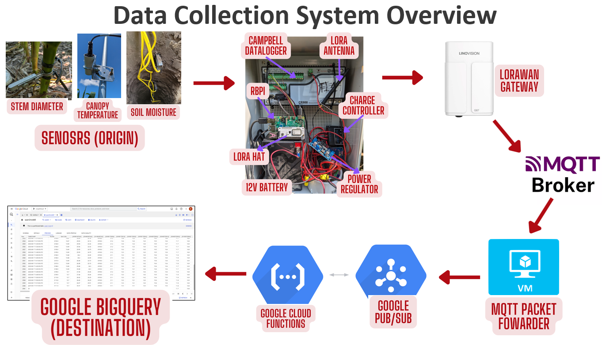

# AgriSense IoT: Precision Agriculture Monitoring System

## Table of Contents
1. [Introduction](#introduction)
2. [System Overview](#system-overview)
3. [Quick Start Guide](#quick-start-guide)
4. [Detailed Setup Instructions](#detailed-setup-instructions)
   - [Raspberry Pi Setup](#raspberry-pi-setup)
   - [Field Sensor Configuration](#field-sensor-configuration)
   - [LoRa Gateway Configuration](#lora-gateway-configuration)
   - [Google Cloud Platform Setup](#google-cloud-platform-setup)
   - [Cloud Functions Deployment](#cloud-functions-deployment)
   - [BigQuery Setup](#bigquery-setup)
5. [Usage and Monitoring](#usage-and-monitoring)
6. [Troubleshooting](#troubleshooting)
7. [Advanced Configuration](#advanced-configuration)
8. [Contributing](#contributing)
9. [License](#license)

## Introduction

AgriSense IoT is an environmental monitoring system designed for precision agriculture. It integrates field sensors, edge computing, LoRa communication, and cloud-based data processing to provide real-time insights into crop conditions.

## System Overview



1. **Field Layer**: SDI-12 sensors connected to a Campbell CR800 datalogger
2. **Edge Layer**: Raspberry Pi with LoRa HAT (RAK811)
3. **Communication Layer**: LoRa network with gateway
4. **Cloud Layer**: 
   - Google Cloud Platform (GCP) Virtual Machine
   - MQTT Broker (EMQX)
   - Google Cloud Pub/Sub
   - Google BigQuery
   - Google Cloud Functions

## Quick Start Guide

This guide focuses on setting up the Raspberry Pi component, which is designed for plug-and-play operation.

1. Clone the repository:
   ```
   git clone https://github.com/BryanNsoh/Logger_Lora.git
   cd Logger_Lora
   ```
2. Flash the provided Raspberry Pi image to an SD card
3. Insert the SD card into your Raspberry Pi with the LoRa HAT installed
4. Connect the Raspberry Pi to your Campbell CR800 datalogger via USB
5. Power on the Raspberry Pi
6. The system will automatically start collecting and transmitting data

Note: This quick start assumes you're using the preconfigured sensor setup. For custom configurations, see the Detailed Setup Instructions.

## Detailed Setup Instructions

### Raspberry Pi Setup

If you're not using the preconfigured image:

1. Flash Raspberry Pi OS Lite to an SD card
2. Enable SSH and configure Wi-Fi (if needed) using `raspi-config`
3. Clone the repository:
   ```
   git clone https://github.com/BryanNsoh/Logger_Lora.git
   cd Logger_Lora
   ```
4. Run the automated setup script:
   ```
   sudo bash setup.sh
   ```
   This script will:
   - Install required dependencies
   - Configure the LoRa HAT
   - Set up the data collection service

5. Configure your sensors in `config/sensor_mapping.yaml`
6. Update `config/config.yaml` with your specific LoRa and node settings

### Field Sensor Configuration

1. Connect your SDI-12 sensors to the Campbell CR800 datalogger
2. Upload the appropriate CR800 program:
   - For Corn Fields: `Campbell_Programs/2024_V2_Corn/nodeA.CR8`
   - For Soybean Fields: `Campbell_Programs/2024_V2_Soy/SoyNodeA.CR8`
3. Verify sensor readings on the CR800 display

### LoRa Gateway Configuration

1. Set up your LoRa gateway (e.g., RAK7258) according to the manufacturer's instructions
2. Configure the gateway to forward data to your MQTT broker

### Google Cloud Platform Setup

1. Create a new GCP project
2. Enable the following APIs:
   - Compute Engine API
   - Pub/Sub API
   - BigQuery API
   - Cloud Functions API
3. Create a service account with the following roles:
   - Pub/Sub Publisher
   - BigQuery Data Editor
   - Cloud Functions Developer
4. Download the service account key as JSON

### Cloud Functions Deployment

Deploy the provided Cloud Functions for data processing:

1. Navigate to the `cloud-functions` directory
2. Deploy the CWSI calculation function:
   ```
   gcloud functions deploy compute-cwsi \
     --runtime python39 \
     --trigger-topic sensor_data \
     --set-env-vars GOOGLE_APPLICATION_CREDENTIALS=path/to/your/service-account-key.json
   ```
3. Similarly, deploy the SWSI and weather update functions

### BigQuery Setup

1. Create a new dataset for your project:
   ```
   bq mk --dataset your_project_id:crop2cloud24
   ```
2. Create tables for each node using the provided schema:
   ```
   bq mk --table crop2cloud24.node_a schema.json
   bq mk --table crop2cloud24.node_b schema.json
   bq mk --table crop2cloud24.node_c schema.json
   ```

## Usage and Monitoring

1. The Raspberry Pi will automatically collect and transmit data
2. Monitor data flow:
   - Check LoRa gateway logs for incoming packets
   - View MQTT broker dashboard for message throughput
   - Use GCP Monitoring to track Pub/Sub and BigQuery metrics
3. Query BigQuery tables for data analysis

## Troubleshooting

- **No data from sensors**: 
  - Check CR800 connection: `ls /dev/ttyUSB*`
  - Verify sensor config: `cat config/sensor_mapping.yaml`
- **LoRa transmission issues**: 
  - Check LoRa HAT connection: `sudo i2cdetect -y 1`
  - Verify LoRa config: `cat config/config.yaml`
- **No data in BigQuery**: 
  - Check Cloud Functions logs in GCP Console
  - Verify Pub/Sub subscription in GCP Console

## Advanced Configuration

- Custom sensor integration: Edit `src/data_logger.py`
- LoRa parameters tuning: Modify `src/lora_functions.py`
- Cloud Function customization: Update files in `cloud-functions/`

## Contributing

Contributions are welcome! Please see [CONTRIBUTING.md](CONTRIBUTING.md) for details on how to submit pull requests, report issues, or request features.

## License

This project is licensed under the MIT License - see the [LICENSE](LICENSE) file for details.